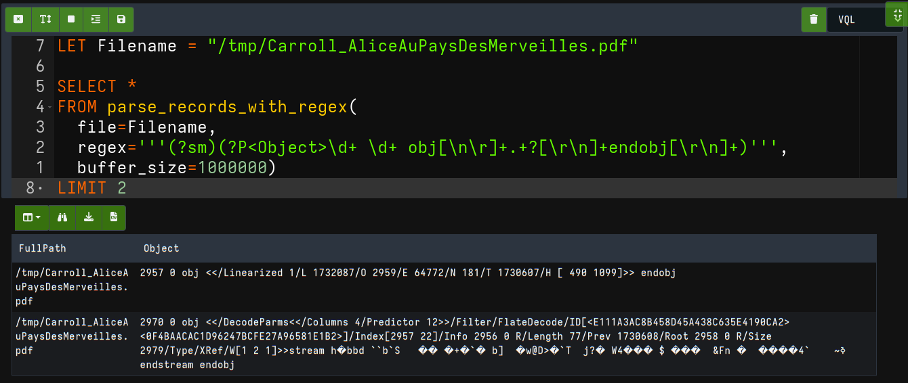
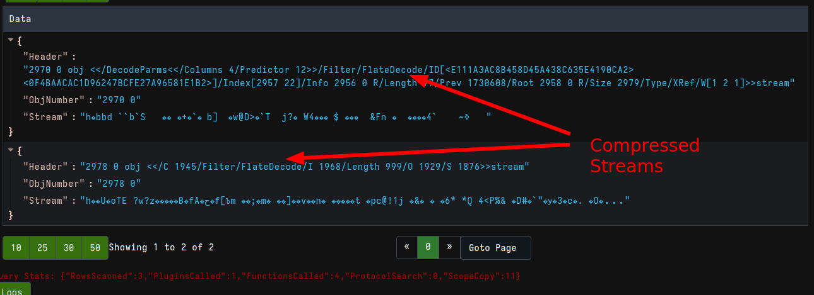
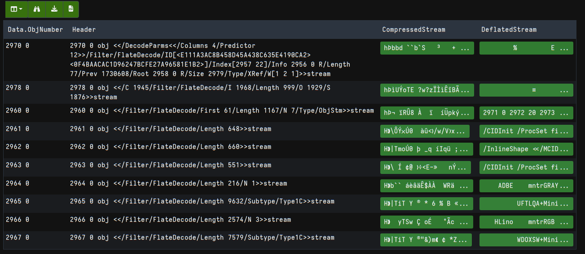
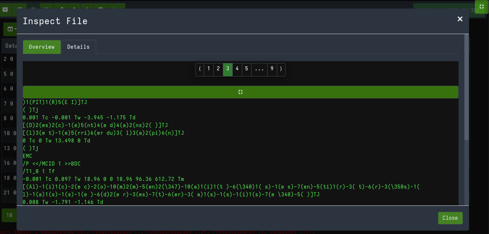
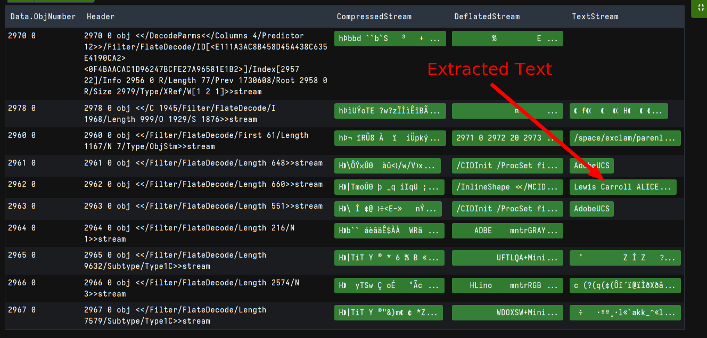
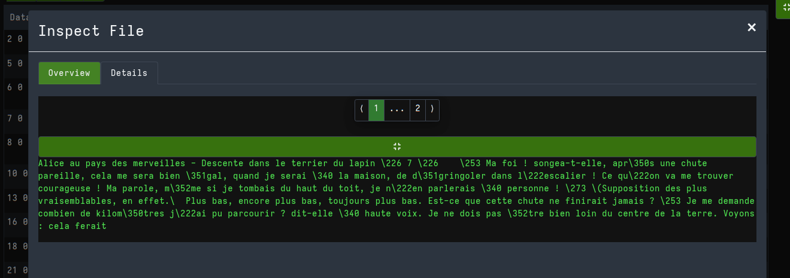
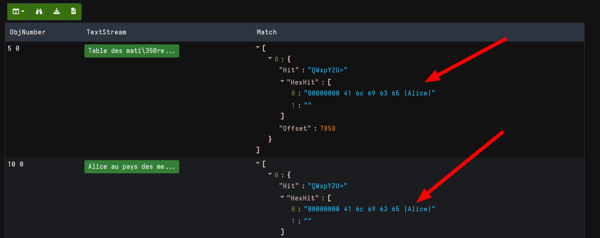

A Velociraptor user has recently raised the question of how to search
PDF file with Velociraptor. Velociraptor has a number of artifacts
designed to search files (or process memory) using Yara signatures
(e.g. `Windows.Search.FileFinder`).

However these usually fail when searching PDF files. The reason is
because text is often compressed within PDF files leading to a simple
Yara scan to fail.

In this post I will describe a pure VQL solution to search within PDF
files. I thought I would write it as a blog post to illustrate how one
can develop a sophisticated new detection method using only the built
in VQL capabilities within Velociraptor.

For this blog I will use the sample text [Alice Au Pays Des Merveilles by Lewis Carroll](http://www.crdp-strasbourg.fr/je_lis_libre/livres/Carroll_AliceAuPaysDesMerveilles.pdf). This PDF contains a variety of elements including images, text etc.

## What are PDF files?

In the general discussion I will only discuss the bare information
related to PDF files relevant to this discussion. There are many
proper references for the PDF file format elsewhere.

PDF files are actually text based (with binary data interspesed). You
can see the general structure of a PDF in a hexeditor or using the
`less` command (On Linux we generally need to specify the `-L` flag to
avoid interpreting the PDF).

```text
%PDF-1.5^M%<E2><E3><CF><D3>
2957 0 obj^M<</Linearized 1/L 1732087/O 2959/E 64772/N 181/T 1730607/H [ 490 1099]>>^Mendobj^M
2970 0 obj^M<</DecodeParms<</Columns 4/Predictor 12>>/Filter/FlateDecode/ID[<E111A3AC8B458D45A438C635E4190CA2><0F4BAACAC1D96247BCFE27A96581E1B2>]/Index[2957 22]/Info 2956 0 R/Length 77/Prev 1730608/Root 2958 0 R/Size 2979/Type/XRef/W[1 2 1]>>stream
h<DE>bbd^P``b`S^E^R^L<B3><80>^D<93>+<90>`<FD>^Hb]^@^R<CC>w@D><90>`T^A^Rj?<80>^DW4<90><90><FB>^L$<U+009C><80><84><DB>
^F&Fn^Y<90>^A^L<8C><B8><89><FF>ߢ~^A^D^X^@`4^L^Y
endstream^Mendobj^M
```

### PDF Objects

We immediately notice that the file is split into `Objects`. Each
object has an ID, starts with some header data and possibly a binary
`Stream`. The object ends with the keyword `endobj`

## Parsing the PDF

The first step is to split the file into separate objects. We see that
each object starts and ends with a unique pattern. Typically we use
regular expressions to parse text based files such as this. The
`parse_records_with_regex` plugin is used to spit a file into broad
based "records". Many textual file formats consist of repeated
"records" throught the file, so this is the perfect tool for this type
of file.

For now we just want to extract a couple of objects for inspection. In
our notebook we use the following VQL:

```vql
LET Filename = "/tmp/Carroll_AliceAuPaysDesMerveilles.pdf"

SELECT *
FROM parse_records_with_regex(
  file=Filename,
  regex='''(?sm)(?P<Object>\d+ \d+ obj[\n\r]+.+?[\r\n]+endobj[\r\n]+)''',
  buffer_size=1000000)
LIMIT 2
```

The regular expression uses `Capture Variables` to capture particular
patterns from the match and name them (for example `(?P<Object>\d+
\d+)` will capture the entire object data into a column called
`ObjNumber`).

The `parse_records_with_regex()` plugin will isolate each match into a
"record". Therefore we need the regex to capture the entire object
(until the `endobj` keyword)



## Decoding streams

Lets extract the main components of each object for further
processing. Each object has the following attributes:

* The object number - identifies the object in the file
* The object header - contains a number of PDF attributes, such as
  `/FlateDecode`
* Some objects contains a `Stream` denoted between the `stream` and
  `endstream` keywords.

For our purposes we do not need a complete PDF parser! We only need to
be able to decode the binary streams so we can scan them properly. We
therefore only really care about streams, and only compressed streams
(because uncompressed streams will already match the regular Yara
scans). As shown above, compressed streams are denoted by
`/FlateDecode` in the object header, so we can add a `WHERE` statement
to only see those streams.

We can extract each `Object` match into a record and further split it
into its attributes using the `parse_string_with_regex()` VQL function:

```vql
LET Filename = "/tmp/Carroll_AliceAuPaysDesMerveilles.pdf"

LET Parsed = SELECT parse_string_with_regex(
    string=Object,
    regex='''(?sm)(?P<Header>(?P<ObjNumber>\d+ \d+) obj[\r\n]+.+?stream)\r?\n(?P<Stream>.+?)endstream''') AS Data
FROM parse_records_with_regex(
    file=Filename,
    regex='''(?sm)(?P<Object>\d+ \d+ obj[\n\r]+.+?[\r\n]+endobj[\r\n]+)''',
    buffer_size=1000000)
WHERE Data.Stream
LIMIT 2

SELECT * FROM Parsed
```

The `parse_string_with_regex()` is used to split the each "record"
into a `Header`, an `ObjNumber` and a `Stream`.



## Decompressing Streams

Compressed streams in PDF are compressed using the `zlib deflate`
algorithm. Velociraptor does not have a built in way to handle
`deflate` specifically but Velociraptor does support `gzip`
compression.

It turns out that `gzip` is basically the same as `deflate` except it
has a slightly different header (and checksums). We can therefore
easily convert the `deflate` stream into a regular `gzip` by removing
the `deflate` header and sticking a fake `gzip` header instead. See [Deflate (zlib) compressed data format specification](https://github.com/libyal/assorted/blob/main/documentation/Deflate%20(zlib)%20compressed%20data%20format.asciidoc) and [GZIP file format specification](https://www.rfc-editor.org/rfc/rfc1952)

I will define a helper function in VQL to decompress deflate streams:

```vql
-- To decompress a deflate stream convert to a gzip file by
-- slapping a header on top and removing the deflate header.
LET Deflate(Stream) = read_file(
    length=100000,
    accessor="gzip",
    filename=pathspec(
      DelegateAccessor="data",
      DelegatePath="\x1F\x8B\x08\x00\x00\x00\x00\x00\x00\x03" + Stream[2:]))
```

I would like to inspect the decoded data in the GUI. Since the
deflated stream might be large, I will upload it as a file, then set
the column type to be a preview. This allows the GUI to preview
arbitrary amount of data easily.

```vql
LET ColumnTypes = dict(CompressedStream="upload_preview",
   DeflatedStream="upload_preview")

SELECT Data.ObjNumber,
  Data.Header AS Header,
  upload(accessor="data", file=Data.Stream,
     name="Compressed "+Data.ObjNumber) as CompressedStream,
  upload(accessor="data", file=Deflate(Stream=Data.Stream),
     name="Deflated "+Data.ObjNumber) AS DeflatedStream
FROM Parsed
```

I upload the compressed stream for each object as as separate file,
then also upload the deflated version of the same stream.



Clicking on one of the streams allows me to page through the data uploaded



## Extracting text from decoded streams

We can now see the decoded data within the PDF file but it does not
really look like the text itself! It turns out that PDF is really a
printing format, which means the text is rarely written as a plain
text string. In fact, in many cases every letter is layed out
specifically on the page!

For example consider the following exctact from one of the streams we decoded earlier:
```text
/T1_0 1 Tf
-0.001 Tc 0.097 Tw 18.96 0 0 18.96 96.36 612.72 Tm
[(Al)-1(i)1(c)-2(e c)-2(o)-10(m)2(m)-5(en)2(\347)-10(a)1(i)1(t )-6(\340)1( s)-1(e s)-7(en)-5(ti)1(r)-3( t)-6(r)-3(\350s)-1( l)-1(a)1(s)-1(s)-1(e )-6(d)2(e r)-3(es)-7(t)-6(er)-3( a)1(s)-1(s)-1(i)1(s)-7(e \340)-5( )]TJ
0.008 Tw -1.791 -1.146 Td
```

We can almost see the text but many letters are surrounded by
parentheses. If we strip out the extra parentheses we can get a fair
idea of the actual text.

Let's define a few more VQL helper functions. The first extracts
individual letters surrounded by bracket, while the second joins those
into a single string.

```vql
LET Letters(Data) = SELECT X
  FROM parse_records_with_regex(
     accessor="data",
     file=Data,
     regex='''\((?P<X>.+?)\)''')

LET Text(Data) = join(sep="",array=Letters(Data=Data).X)
```

Now we can also upload the decoded text as another field.

```vql
SELECT Data.ObjNumber,
  Data.Header AS Header,
  upload(accessor="data", file=Data.Stream,
     name="Compressed "+Data.ObjNumber) as CompressedStream,
  upload(accessor="data", file=Deflate(Stream=Data.Stream),
     name="Deflated "+Data.ObjNumber) AS DeflatedStream,
  upload(accessor="data", file=Text(Data=Deflate(Stream=Data.Stream)),
     name="Text "+Data.ObjNumber) AS TextStream
FROM Parsed
```





## Filtering for keywords

The last step is to scan the decompressed text for
keywords. Velociraptor uses Yara rules for keyword matches.

I will create a helper VQL function that reports the first hit of the
yara rule on a data stream, and apply the function to the combination
of the decompressed stream as well as the extracted text. This will
fire when the phrase appears in either form.

```vql
LET YaraRule = '''
rule X {
  strings:
    $a = "Alice"
  condition: any of them
}
'''

LET MatchRule(Data) = SELECT String.Data AS Hit,
    String.HexData as HexHit,
    String.Offset AS Offset
FROM yara(accessor="data",
    files=Data,
    number=1,
    rules=YaraRule)
LIMIT 1

LET Decoded = SELECT Data.ObjNumber AS ObjNumber,
 Data.Header AS Header,
 Data.Stream AS CompressedStream,
 Deflate(Stream=Data.Stream) AS DeflatedStream,
 Text(Data=Deflate(Stream=Data.Stream)) AS TextStream
FROM Parsed

SELECT ObjNumber, Header,
    upload(accessor="data", file=CompressedStream,
           name="Compressed "+ObjNumber) as CompressedStream,
    upload(accessor="data", file=DeflatedStream,
           name="Deflated "+ObjNumber) AS DeflatedStream,
    upload(accessor="data", file=TextStream,
           name="Text "+ObjNumber) AS TextStream,
    MatchRule(Data=DeflatedStream + TextStream) AS Match
FROM Decoded
WHERE Match
```

We can now report only those rows that contain a match by adding the
`WHERE Match` condition.



## Converting to an artifact


## Conclusions

In this
